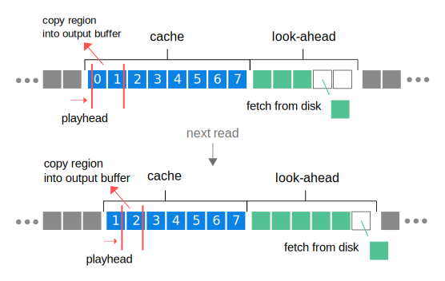

# 🏞️ creek 🏞️

[](https://docs.rs/creek)
[](https://crates.io/crates/creek)
[](https://github.com/RustyDAW/creek/blob/main/COPYRIGHT)

Realtime-safe streaming to/from audio files on disk.

The included decoder uses [Symphonia](https://github.com/pdeljanov/Symphonia). Refer to [Symphonia's documentation](https://docs.rs/symphonia/latest/symphonia/#support) for supported codecs. Symphonia's Cargo features are exposed with the prefix `decode-`, except `aac` and `isomp4` which creek does not work with yet. For example, to enable MP3 decoding in creek, enable the `decode-mp3` feature.

The included encoder only supports the WAV format.

## How the Read Stream Works



The stream internally has two types of buffers: a `cache` buffer and `look-ahead` buffer.

A `cache` buffer is a pre-loaded user-defined range of samples in the file.

The stream can have as many `cache` buffers as desired. A common use case for this is to cache the start of a file or loop region for seamless looping. When seeking to a frame in the file, creek searches if there exists a cache that contains that frame. If one exists, then playback can resume immediately without buffering.

The `look-ahead` buffer is used to automatically load frames ahead of the playhead, ensuring that data will always be ready even in a worse-case IO latency scenario.

If a suitable cache is not found (or the cache is not yet loaded), then the `look-ahead` buffer will need to be filled first before any more data can be read. When that happens, you may choose to either continue playback (which will output silence), or temporarily pause playback until data is available.

Creek automatically spawns an "IO server" thread that handles the non-realtime operations. This server is automatically closed when the stream is dropped.

## How the Write Stream Works

The write stream works how you would expect. Once a block is filled with data, it is sent to the IO server thread to be written. Once the server thread is done with that block, it sends it back to the write stream to be reused.

## Examples

### Simple Usage Example

```rust
use creek::{
    SymphoniaDecoder, SeekMode, ReadDiskStream,
    WriteDiskStream, WavEncoder, wav_bit_depth
};

// Open a read stream.


let mut read_disk_stream = ReadDiskStream::<SymphoniaDecoder>::new(
    "./test_files/wav_f32_stereo.wav",  // Path to file.
    0,  // The frame in the file to start reading from.
    Default::default(),  // Use default read stream options.
).unwrap();

// Cache the start of the file into cache with index `0`.
let _ = read_disk_stream.cache(0, 0);

// Tell the stream to seek to the beginning of file. This will also alert the stream to the existence
// of the cache with index `0`.
read_disk_stream.seek(0, Default::default()).unwrap();

// Wait until the buffer is filled before sending it to the process thread.
//
// NOTE: Do ***not*** use this method in a real-time thread.
read_disk_stream.block_until_ready().unwrap();

// (Send `read_stream` to the audio processing thread)


// Open a write stream.


WriteDiskStream::<WavEncoder<wav_bit_depth::Float32>>::new(
    "./test_files/wav_f32_stereo_out.wav",  // Path to file.
    2,  // The number of channels in the file
    44100,  // The sample rate of the file
    Default::default(),  // Use default write stream options.
).unwrap();

// (Send `write_stream` to the audio processing thread)


// -------------------------------------------------------------


// In the realtime audio processing thread:


// Update read client and check if it is ready.
//
// NOTE: You should avoid using `unwrap()` in realtime code.
if !read_disk_stream.is_ready().unwrap() {
    // If the look-ahead buffer is still buffering, We can choose to either continue
    // reading (which will return silence), or pause playback until the buffer is filled.
}

let read_data = read_disk_stream.read(num_frames_in_output_buffer).unwrap();

println!("{}", read_data.num_frames());
println!("{}", read_data.num_channels());

// Seek to a new position in the file.
read_disk_stream.seek(50000, SeekMode::Auto};

assert_eq!(read_dist_stream.playhead(), 50000);


// Send stereo data to be written to disk.

write_disk_stream.write(
    &[read_data.read_channel(0), read_data.read_channel(1)]
).unwrap();
```

### Demos

- A basic [`player app`] that plays a single wav file with adjustable loop regions.
- A basic [`writer app`] that records a tone to a wav file.

[`player app`]: https://github.com/MeadowlarkDAW/creek/tree/main/demos/player
[`writer app`]: https://github.com/MeadowlarkDAW/creek/tree/main/demos/writer

## Contributing

We use various [pre-commit](https://pre-commit.com) hooks to ensure that the code style and formatting
is consistent.

Follow the [installation instructions](https://pre-commit.com/#install) on how to set up _pre-commit_ for your development system. This allows you to run the checks locally before committing code
and waiting for the CI results:

```sh
pre-commit run --all-files
```

### Git

Conventions for working with Git:

- Commits should follow the [seven rules](https://cbea.ms/git-commit/#seven-rules).
- Versions are tagged with the prefix `v` followed by the crate's version number to match those displayed on the [crates.io](https://crates.io/crates/creek) page.
